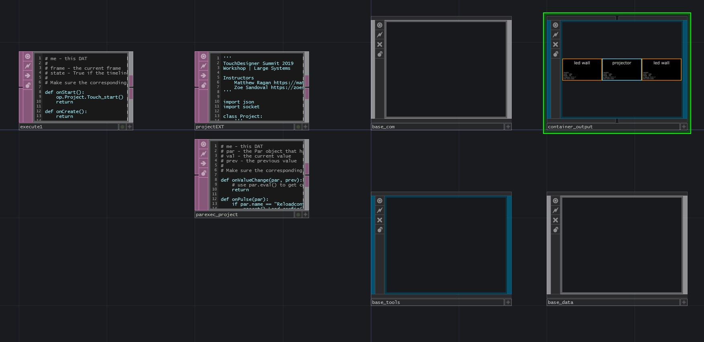

# TouchDesigner Summit 2019 | Large Systems



## Artist Instructors
Matthew Ragan | [matthewragan.com](https://matthewragan.com)  
Zoe Sandoval | [zoesandoval.com](https://zoesandoval.com)  
Materializing Interactive Research | [mir.works](https://mir.works)

## Dependencies
* [TouchDesigner099](https://www.derivative.ca/099/Downloads/)

## Recommended Tools
Having an external text editor is key to lots of work in Touch. I like VS Code these days, though Submlime is also a solid choice
* [VS Cide](https://code.visualstudio.com/)
* [Sublime Text](https://www.sublimetext.com/)

## Schedule
Time | Topic
---- | ----
2:30 pm | Intro & Why Externalize 
3:00 pm | Organizing Your Project & The Save Tox
3:30 pm | Using Custom Parameters & Building Blueprints
4:30 pm | Automation Example - Config & Displays

5:30 pm | Python Inheritance - Going to the Next Level
6:00 pm | Wrap

## Overview
How you design, plan, and extend a system is a both an engineering and creative endeavor. The choices you make will have lasting impact in the way you work, what your system can do, what it can't do, and how easy it will be to maintain and adapt for future work. A little planning and thoughtful organization will help make sure that you're able to focus on the work that's the most exciting rather than always remaking all of the same pieces. Take it from someone who has built a lot of systems from the ground up - a good foundation keeps you excited and interested in your work, rather than always repeating the same mistakes.

Over the course of this workshop we'll take a look a fundamental concepts for this kind of work - What is externalization, why do it in the first place, and how much is too much. We'll also look at some perspectives about organization that come from building large projects, what it means to build templates / blueprints that you can reuse, how to take advantage of some simple automation, and where you can begin to take advantage of some more advanced ideas. 

### Major Goals
* **No delay scripts** unless there is no other solution
* Complete control over initialization and load order
* Text-port confirmation of each step (ultimately you want this to be a log-file)

## Intro & Why Externalize 
Externalizing toxes is a great way to build some modular segmentation into your workflow, but why does it matter? It seems like a lot of extra work, and aside from being a "best practice" why bother? Those are great questions, and reasonable concerns. What I see most often here is that when we're first getting started with Touch it's easy to only work in a single project. Maybe there are some killer pieces in that project, and when we start another one, we copy the whole toe file and then hack it all apart and move it all around. It's easy to do this, and fast... but at some point you'll wonder where that one great feature was that you built for that one project. Because toe files are [binary](https://en.wikipedia.org/wiki/Binary_file) it's not easy to compare them - in fact it's very difficult. So what can you do? Well, you can open them up one at a time until you find the right file. Then you have to figure out how to separate out the bits you want from all the other stuff. Once you manage to do that you realize you may have been better off just writing all from scratch again. 

There are lots of good examples in TouchDesigner of where you don't have to do that though - just open up the Palette and you'll find a wealth of tools / modules that make sure you don't need to work from the ground-up every time. That's our big effort here - what if we think about the tool we want to use for installations as a collection of modules we can easily swap in or out depending on the job we're doing? Enter toxes - have a great way to calibrate LED screens? Perfect, make that into a tox that's easy to add to your projects. Have your favorite way to send and receive messages? Excellent, that sounds like a perfect communications module. Do you have some tools for copying data between machines - amazing, let's wrap that up in a tox.

So now you've got a handful of building blocks you can assemble - but besides organization, what's the pay off here? Well, the other benefit is that you now have a way to work on a team. Working with a single toe file, only one developer at a time can make edits. Working with tox modules you can now split up that work across a whole team and work on different parts of the project at the same time. Which means you can also keep track of who made changes. This also creates openings to use things like create software branches and separate out your experiments, from your production ready code. There's lots of other pieces to take advantage of here, but these really get us going out the gate and will make a big difference if you want to level up your working style.

Learn more about Git and working with touch here:  
* [TouchDesigner and Version Control](https://matthewragan.com/2017/12/03/touchdesigner-working-styles-git/)

## Organizing Your Project
Finding the right number of core components is difficult, and where I've landed is with four primary components. Each of these have their own sub-components, but to me these are the top level pieces that every project I've worked on has ended up needing at one point or another:
* Communication
* Output
* Tools
* Data

### Communication
I've spent a lot of time working on larger distirbuted systems, and how you talk between machines is a big part of the equation here. Maybe you don't lots of machines you're trying to coordinate, but at some point you'll probably want to talk to something besides TouchDesigner - maybe there's a web scheduler that got integrated, or an OSC interface, or a MIDI controller. Rather than embedding that communcation element in some specific part of your network, I think it's better to give it a little space all its own. 

### Output
TouchDesigner is a great platform for making visual pieces, and the output from that process is often what we care about. But outputs come in all shapes and sizes - maybe you just want a control UI, or maybe  you're trying to drive 4 x 4k outputs. To me, outputs is where we think about what's getting drawn on the screen or projector.

### Tools
It's often helpful to have a handful of tools that you can use in projects - from the little things like moving / copying files around, to logging errors, or more complicated pieces like finding the dominant color in an image. I think of tools as a little bag of goodies useful for all sorts of various operations. 

### Data
If you're doing projection mapping you probably have a model of your architecture. If you're visualizing a big data set, there's probably some big spreadsheets you want to have access to, or maybe you have some assets that need to be accessible across all of your machines. I think of Data as the place that houses all of the big elements your project will need access to - no matter what job it's dedicated to doing.

## The Save Tox
An example of a tool we can take a look at is a little handy saving mechanism to help simplify the process of externalizing your pieces. This save tox is similar to something we used at Obscura, and your invited to change it, remix it, or alter it so it best fits your workflow. In the context of this workshop we can take a look at this tool as a kind of example of how and what we might build that's reusable. 

You can download the save tox from here:  
* [TouchDesigner-save-external](https://github.com/raganmd/touchdesigner-save-external)

## Using Custom Parameters & Building Blueprints
Working with Custom Parameters is really a game changer for TouchDesigner. These made for monumental leaps in building components without having to write a complex Python interface, or create a control panel - both of which could be major time commitments. We wont cover the whole gamut of pieces that come along with using custom parameters, but we will take a little time to understand how we can best take advantage of them when building something like blueprints.

What's a blueprint? In this context, we can think of a blueprint as a code block that has all of the scaffolding that we need for a particular job. We'll specifically be looking at displays, and how we think about creating pieces for different types of outputs. The handles you need for controlling a projector are a little different than what you think of for a projector. The big picture here, however, is we want to think of these modules as being general enough to be applied in many use cases, and to have any needed parameters exposed at the top level as Custom Parameters. In an ideal world, we NEVER reach into this component, and any change we make inside is something that all other instances of this component will have. This concept is already familiar to us in Touch as Clones, and what we're up to here is very similar.

You can learn more about Custom Paramters here:  
* [Elburz on Custom Pars](https://www.elburz.io/touchdesigner-beginner-tricks/)
* [Custom Pars and Cue Building](https://matthewragan.com/2019/05/06/touchdesigner-case-study-custom-parameters-and-cues/)

## Automation Example - Config & Displays
To really dig down to the nitty gritty we'll take a look at how some of this works when writing a custom automation script. This will be similar to what we might do with a replicator COMP, but instead we'll end up with full control of how we set-up, place, name, and initialize our pieces. Digging deep here will give us some better insight into what the automation process looks like, as well as the concepts you need for applying these same ideas to other pieces in your projects. As a bonus we'll walk away from this portion of the workshop being able to re-configure our project just by altering a text file. That might not seem rad, but it means faster setup, configuration, and freedom from all of the fussy parts of getting a configuration ready either for a permanent installation, or for a VJ set. 

## Python Inheritance - Going to the Next Level
Finally, we'll wrap the day with a look at some OOP concepts that you can use to take what we've done to the next level. Specifically, we'll look at Inheritance. Believe it or not we already understand this concept very deeply just working with Touch, and this will be a chance for us to deepen and extend our perspective. 

## Other Considerations
Another bit that's worth thinking about is if you're going to be running on systems with multiple GPUs. On those systems you have to set your GPU affinity at start. Derivative recommends doing this with a `.bat` or .`cmd` file. The trick for us here is that our schema of using a separate python file to indicate our indication will break - in the case of using a system with multiple GPUs, you likely want those two networks configured slightly differently. We can address this by using environment variables instead of a stand alone .json file. Depending on your workflow you might want to move this direction generally, but it's a little more advanced than we have time to cover in this workshop. 

While we might not have time to go into detail in the workshop, we can leave this little reference here so you can come back to this part when you're ready to push a little harder on start-up configuration. The big idea is that rather than using that `outputlist.json` file to tell us how to configure our project, we can instead use environmnet variables. Touch will read environment variables that are called before the appliaction starts with the Python syntax:  
`var.("my_var_name")`  
We'd have to re-arrange a little logic in our project, but once we did that we'd be able to set our project's configuration from another script at start-up. You could do this eithe with a `.cmd` script or with Python script. For the more advanced users, if you have another watch application keeping tabs on your Touch project you'd want to add a mechanism to set an environment variable before starting the target application. 

Here's a quick run down of what this might look like if you're running a batch script or a python script.

Setting environment variables in a windows batch script
```bat
:: echo
:: Display messages on screen, turn command-echoing on or off.

:: "%~dp0"
:: The %~dp0 (that's a zero) variable when referenced within a Windows batch file will expand to 
:: the drive letter and path of that batch file. The variables %0-%9 refer to the command line 
:: parameters of the batch file. %1-%9 refer to command line arguments after the batch file name. 
:: %0 refers to the batch file itself.

:: as a note this CMD or BAT needs to run as admin in order to work correctly

@echo off

set STARTUP=controller
timeout /t 1
start "%programfiles%\derivative\touchdesigner099\bin\touchdesigner099.exe" "%~dp0\env-vars.toe"

set STARTUP=node
timeout /t 1
start "%programfiles%\derivative\touchdesigner099\bin\touchdesigner099.exe" "%~dp0\env-vars.toe"
```

Setting environment variables with Python
```python
import os

toe_file = 'path\\to\\your\\file.toe'

# set environment variable
toe_env_var             = 'controller'
os.environ['STARTUP']   = toe_env_var
os.startfile(toe_file)
print("startting file with {}".format(toe_env_var))

# set environment variable
toe_env_var             = 'node'
os.environ['STARTUP']   = toe_env_var
os.startfile(toe_file)
print("startting file with {}".format(toe_env_var))
```

## Wrap
By the end of the workshop we should have converged a whole host of concepts. From the abstract and conceptual frames that help us plan out our work, to the nitty gritty process of writing our extensions we'll do a little bit of all of it. Our hope is that you'll walk away from this workshop not only with an idea of how to start approaching your large projects, but also how to better create modular approaches that help you stop repeating yourself from project to project.